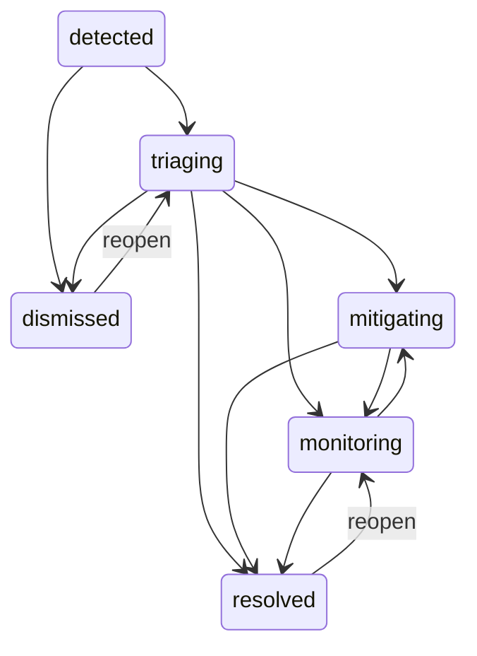

# RelayOps transformation spec

**Working codename:** RelayOps — требует trademark clearance  
**Статус:** approved product direction; planning only  
**Исходная платформа:** Kaneo `2.22.0`, commit `8100f3b1...`  
**Дата:** 2026-08-27

## 1. Product thesis

RelayOps — self-hosted realtime incident operations platform для небольших и средних engineering teams. Продукт помогает быстро ответить на четыре вопроса:

1. Что сейчас сломано или деградирует?
2. Кто координирует response?
3. Что изменилось с момента detection?
4. Где команда системно теряет время и надёжность?

RelayOps не заменяет monitoring stack и не является generic task manager. Он находится между incoming signals, людьми, operational decisions и post-incident analytics.

### Product promise

> One operational picture from first signal to verified recovery.

### Принципы

- Calm under pressure: critical information заметна без визуального шума.
- Time is first-class: elapsed time, phase transitions и stale updates видны всегда.
- URL is the workbench state: любой operational view можно открыть, сохранить и передать.
- Authority is explicit: UI показывает capability, API enforce-ит permission.
- Realtime is visible: connection, presence, conflicts и stale data не скрываются.
- History is durable: timeline нельзя строить только на best-effort WebSocket events.
- Self-hosting remains simple: PostgreSQL обязателен; Redis и external services optional.

## 2. Пользователи и роли

### Personas

| Persona | Главная задача | Боль |
|---|---|---|
| Responder | Быстро понять контекст и выполнить mitigation | Сигналы и решения разбросаны по чатам и dashboards |
| Incident Commander | Координировать людей, severity и transitions | Не видно ownership, времени и конфликтующих изменений |
| Service Owner | Понимать состояние своего сервиса и повторяющиеся failure patterns | Инциденты не связаны с service catalog и историей |
| Reliability Lead | Анализировать MTTA/MTTR, hotspots и процесс | Отчёты ручные, definitions расходятся |
| Workspace Admin | Управлять доступом, integrations и data boundaries | UI visibility часто принимают за authorization |

### Built-in role templates

Роли — editable templates поверх canonical permissions. API проверяет capabilities, а не названия ролей. Суффикс `_owned` означает server-side scope по `ownerTeamId` primary service инцидента; secondary affected service не выдаёт права.

| Canonical capability | Viewer | Responder | Incident Commander | Service Owner | Workspace Admin |
|---|:---:|:---:|:---:|:---:|:---:|
| `service:read`, `incident:read`, `incident_timeline:read` | ✓ | ✓ | ✓ | ✓ | ✓ |
| `incident:create`, `signal:attach` |  | ✓ | ✓ | ✓ | ✓ |
| `incident_timeline:publish` |  | ✓ | ✓ | ✓ | ✓ |
| `incident_timeline:correct` |  |  | ✓ |  | ✓ |
| `incident:update` / `incident:update_owned` |  | workspace | workspace | owned | workspace |
| `incident:transition` / `incident:transition_owned` — non-terminal only |  | workspace | workspace | owned | workspace |
| `incident:assign` / `incident:assign_owned` |  |  | workspace | owned | workspace |
| `incident:severity` / `incident:severity_owned` |  |  | any severity | owned non-SEV1 | any severity |
| `incident:resolve` / `incident:resolve_owned` |  |  | any severity | owned non-SEV1 | any severity |
| `incident:reopen` / `incident:reopen_owned` |  |  | any severity | owned non-SEV1 | any severity |
| `incident:dismiss` / `incident:dismiss_owned` |  |  | any severity | owned non-SEV1 | any severity |
| `service:update_owned`, `service:archive_owned` |  |  |  | owned | workspace equivalents |
| `analytics:read` | ✓ | ✓ | ✓ | ✓ | ✓ |
| `analytics:export` |  |  | ✓ | ✓ | ✓ |
| Manage roles/integrations/workspace |  |  |  |  | ✓ |

`incident:transition` покрывает только non-terminal transitions: `detected -> triaging`, `triaging -> mitigating|monitoring`, `mitigating -> monitoring` и `monitoring -> mitigating`. Переходы в `resolved`/`dismissed` и выход из terminal state требуют отдельных `resolve`/`dismiss`/`reopen` capabilities.

Severity policy является дополнительной к capability:

| Action | Incident Commander | Service Owner | Workspace Admin |
|---|---|---|---|
| Change severity | Любое значение, включая переход к/от `sev1` | Только owned incident, если current и target severity не `sev1` | Любое значение |
| Resolve | Любой разрешённый source status и severity | Только owned incident с severity не `sev1` | Любой разрешённый source status и severity |
| Reopen | `resolved -> monitoring` или `dismissed -> triaging`, включая `sev1` | Те же переходы только для owned incident с severity не `sev1` | Те же переходы, включая `sev1` |
| Dismiss | `detected|triaging -> dismissed`, включая `sev1` | Только owned incident с severity не `sev1` | `detected|triaging -> dismissed`, включая `sev1` |

Любой SEV1 severity change, resolve, reopen или dismiss требует Incident Commander либо Workspace Admin. Поле `commanderId` само по себе capability не выдаёт. Ownership-based permissions имеют явную server-side policy и integration tests; UI predicate недостаточен.

## 3. Domain model

### Workspace

Существующая верхняя collaboration и authorization boundary. Workspace data никогда не смешивается в queries, events, WebSockets, analytics или exports.

### Service

Операционная единица: API, web application, database, worker или external dependency.

Ключевые поля:

- `id`, `workspaceId`, `slug`, `name`, `description`;
- `tier`: `critical | high | standard | low`;
- `health`: `operational | degraded | major_outage | maintenance`;
- `ownerTeamId`;
- `repositoryUrl`, `runbookUrl` — optional validated public URLs;
- `createdAt`, `updatedAt`, `archivedAt`.

### Signal

Нормализованное входящее наблюдение от webhook/manual input.

- `source`, `externalId`, `fingerprint`;
- `title`, `summary`, `observedAt`;
- `severityHint`, `serviceId`;
- redacted `payload`;
- `deduplicationKey` и ingestion status.

Signal не обязан становиться incident. Один incident может объединять несколько signals.

### Incident

Главный operational object.

- human-readable `key`, например `INC-1042`;
- `title`, `summary`, `status`, `severity`, `impact`;
- primary `serviceId` и additional affected services;
- `commanderId`, responder membership;
- `detectedAt`, `acknowledgedAt`, `mitigatedAt`, `resolvedAt`;
- `lastUpdateAt`, `version`;
- `createdBy`, `createdAt`, `updatedAt`.

Severity: `unknown | sev1 | sev2 | sev3 | sev4`.  
Impact: `unknown | none | degraded | partial_outage | full_outage`.

### Incident timeline event

Append-only durable history:

- `incident.created`;
- `incident.status_changed`;
- `incident.severity_changed`;
- `incident.commander_assigned`;
- `incident.responder_joined`;
- `incident.update_published`;
- `incident.signal_attached`;
- `incident.resolved`;
- `incident.dismissed`;
- `incident.reopened`.

Event хранит actor, timestamp, incident version, typed payload и optional idempotency key. Secret/raw integration payloads в timeline не попадают.

### Saved view

Именованная конфигурация workbench:

- filters, search, sort, group;
- visible/order/pinned/size columns;
- density;
- owner и visibility (`private | workspace`);
- optimistic version для concurrent edits.

## 4. Incident lifecycle

Ниже приведён полный lifecycle. Таблица переходов — authoritative contract; diagram только визуализирует её и не добавляет скрытых переходов.



Authoritative transitions:

| From | To |
|---|---|
| `detected` | `triaging`, `dismissed` |
| `triaging` | `mitigating`, `monitoring`, `resolved`, `dismissed` |
| `mitigating` | `monitoring`, `resolved` |
| `monitoring` | `mitigating`, `resolved` |
| `resolved` | `monitoring` via explicit reopen |
| `dismissed` | `triaging` via explicit reopen |

Rules:

- server rejects every transition not listed in the authoritative table;
- `dismissed` reachable only from `detected` or `triaging`;
- reopen means exactly `resolved -> monitoring` or `dismissed -> triaging`;
- incident state, lifecycle timestamps, durable timeline event и outbox item записываются в одной transaction;
- client отправляет `expectedVersion`;
- stale version возвращает `409` с current representation;
- manual timestamp correction требует отдельной capability и создаёт audit event;
- any `sev1` severity change, resolve, reopen or dismiss requires Incident Commander or Workspace Admin;
- Service Owner may change severity, resolve, reopen or dismiss only for a primary-service-owned incident; terminal actions require current severity not `sev1`, and an owned severity change requires both current and target severity not `sev1`;
- DnD, menu и keyboard actions вызывают один и тот же transition command.

## 5. Information architecture

### Global navigation

```text
Operations
  Overview
  Incidents
  Response board
Services
  Catalog
  Dependencies
Insights
  Reliability analytics
Manage
  Teams and roles
  Integrations
  Workspace settings
```

Project/Task, Backlog, Calendar и Gantt не являются primary navigation нового продукта.

### Operations Overview

- live incident clock rail;
- active incidents ordered by severity and elapsed time;
- services currently degraded;
- unassigned/commanderless incidents;
- current connection health;
- latest operational updates;
- one clear empty-state action: create first service or load demo incident.

### Incident Workbench

Главная desktop surface: virtualized table + toolbar + right inspector.

Default columns:

- key;
- severity;
- status;
- title;
- affected services;
- commander;
- responders;
- detected time;
- elapsed/resolution duration;
- last update age.

Capabilities:

- cursor pagination;
- server-side search/filter/sort;
- faceted filter counts;
- multi-sort;
- grouping by severity/status/service/commander;
- resizable, reorderable, pinnable columns;
- row selection and bulk actions where policy permits;
- saved/private/shared views;
- copyable canonical URL;
- selected incident opens inspector without losing context.

Official implementation references: [TanStack Table overview](https://tanstack.com/table/latest/docs/overview), [manual/server filtering](https://tanstack.com/table/latest/docs/framework/react/guide/column-filtering), [React Virtual](https://tanstack.com/virtual/latest/docs/framework/react/react-virtual).

### Response Board

Secondary projection of the same incident query. Lanes are fixed lifecycle states, not arbitrary Kanban columns.

- pointer, touch and keyboard DnD;
- screen-reader instructions and announcements;
- visible invalid drop targets;
- menu-based “Move to…” alternative;
- one transactional transition command;
- optimistic preview with rollback and retry;
- undo only while server transition remains reversible;
- filters and selected incident share the same URL vocabulary as Workbench.

### Incident Inspector / Incident Room

Inspector preserves table/board context. Canonical full-page room is shareable.

Tabs:

- Overview;
- Timeline;
- Signals;
- Responders;
- Audit.

Incident Room shows:

- severity/status/impact and affected services;
- elapsed incident clock;
- commander/responders;
- durable timeline;
- “last update” freshness;
- connection state and present collaborators;
- conflict banner with reload/compare actions;
- resolution summary.

## 6. URL state contract

URL — canonical state для shareable view. Route search params проходят Zod validation через TanStack Router `validateSearch`. Official rationale and API: [TanStack Router search params](https://tanstack.com/router/latest/docs/guide/search-params).

Workbench search schema:

| Param | Type | Default |
|---|---|---|
| `view` | saved-view UUID | none |
| `q` | trimmed string <= 200 chars | empty |
| `status` | sorted array of lifecycle values | active statuses |
| `severity` | sorted array | all |
| `service` | sorted UUID array | all |
| `commander` | sorted UUID array | all |
| `from`, `to` | ISO date | rolling 30 days |
| `sort` | ordered list, e.g. `-severity,detectedAt` | `-severity,-detectedAt` |
| `group` | enum | none |
| `density` | `compact | comfortable` | compact |
| `columns` | versioned compact column preset | default |
| `incidentId` | UUID | none |
| `tab` | inspector tab enum | overview |

Rules:

- invalid input normalizes to safe defaults and replaces URL once;
- arrays serialize deterministically;
- changing filter/sort resets cursor;
- cursor itself не должен быть частью shareable canonical view;
- back/forward restores filters, selected incident и tab;
- `view` loads a stored base; explicit URL fields override it;
- saved view updates never silently rewrite another user's view;
- copied URL for a shared view must work after refresh and in a second authorized session.

## 7. Realtime contract

### User-visible states

- `connected` — live updates active;
- `reconnecting` — stale badge + retry countdown;
- `offline` — mutations queued only where explicitly safe;
- `stale` — reconnect exhausted; manual retry and last sync time shown.

### Event semantics

- PostgreSQL record is source of truth.
- Every committed Incident mutation atomically writes incident state, durable timeline event и outbox item.
- The vertical tracer includes a minimal PostgreSQL outbox worker: claim, publish through the in-memory adapter, mark published и retry unfinished rows after restart. The later realtime phase hardens backoff, metrics, retention and optional Redis fan-out; no external queue is required.
- WebSocket carries compact invalidation/patch messages with incident id and version.
- Initiating tab performs local optimistic/cache update.
- Other tabs/users receive WebSocket event.
- Reconnect always refetches authoritative incident and active query window.
- Redis remains optional multi-instance fan-out.
- Presence is ephemeral and never used as authorization or durable audit evidence.

### Conflict behavior

On `409 version_conflict` UI:

1. keeps the user's draft;
2. shows who/what changed if available;
3. offers compare, reapply and discard;
4. never shows success toast;
5. sends no duplicate timeline event on retry due idempotency key.

## 8. Analytics

### Metric definitions

| Metric | Definition |
|---|---|
| MTTA | `acknowledgedAt - detectedAt` |
| MTTR | `resolvedAt - detectedAt` |
| Mitigation time | `mitigatedAt - detectedAt` |
| Incident volume | Count by detected date |
| Reopen rate | Resolved incidents with later reopen / resolved incidents |
| Stale update rate | Active incidents without update beyond configured threshold |
| Service hotspot | Incident count and duration grouped by service and severity |

Analytics must show sample size, timezone, excluded/missing data и active filters. `unknown` timestamps не превращаются в zero.

### Interaction

- period comparison;
- severity/service/status faceting;
- chart click writes validated filters to URL;
- filtered chart, table and inspector remain consistent;
- p50/p90 shown where meaningful;
- export includes filter specification and generated-at timestamp;
- users without export capability see no export action and receive API `403` if they call it directly.

## 9. Signal ingestion

MVP supports:

- manual signal;
- generic signed webhook;
- deterministic demo generator.

Requirements:

- workspace-scoped secret;
- signature and replay-window validation;
- body and rate limits;
- idempotency by `(workspaceId, source, externalId)`;
- normalized/redacted payload;
- failed ingestion audit without leaking secrets;
- no automatic outbound request to user-controlled URL.

Full PagerDuty/Datadog/Grafana connectors are post-MVP.

## 10. Visual and interaction direction

### Subject and audience

Subject: operational response under time pressure. Audience: engineers and operations leads using a wide desktop display, sometimes from a laptop during an incident. The single job of the main screen is to turn changing incident state into a trusted shared operational picture.

### Palette

Alerts are scarce semantic signals, not decoration.

| Token | Hex | Use |
|---|---|---|
| Control Ink | `#17211F` | Primary text, dark surfaces |
| Instrument | `#F4F6F5` | Main light canvas |
| Panel Alloy | `#E2E9E6` | Table headers, secondary surfaces |
| Relay Cobalt | `#245EBE` | Focus, links, active controls |
| Caution Amber | `#B9651B` | Warning, reconnecting, SEV3 |
| Incident Vermilion | `#B73A34` | SEV1/critical actions only |

Status is never communicated by color alone; icon, label и shape accompany it.

### Typography

- **Barlow Condensed** — elapsed clocks, severity labels and section heads;
- **Atkinson Hyperlegible** — body, controls and dense table text;
- **IBM Plex Mono** — timestamps, incident keys, versions and machine values.

All proposed fonts require OFL provenance and inclusion in third-party notices before release.

### Layout concept

```text
┌────────────────────────────────────────────────────────────────────┐
│ LIVE INCIDENT CLOCK RAIL · SEV · elapsed · phase · connection     │
├──────────────┬───────────────────────────────────────┬─────────────┤
│ navigation   │ URL-native table / board / analytics │ inspector   │
│ + saved      │ dense, calm, resizable               │ timeline    │
│ views        │                                       │ actions     │
└──────────────┴───────────────────────────────────────┴─────────────┘
```

### Signature element

Live Incident Clock Rail — ordered temporal strip of active incidents with elapsed time and lifecycle phase. It is navigation, connection feedback and urgency model, not a decorative KPI row.

### Restraint

- No generic gradient dashboard hero.
- No field of equally weighted rounded cards.
- 4–6 px radii, clear rules and aligned columns.
- Severity color appears only where urgency changes a decision.
- One orchestrated motion moment: a new timeline event enters and the clock rail reorders.
- Standard transitions 120–180 ms; DnD settle <= 200 ms.
- Reduced motion removes spatial movement but preserves status change.

### Responsive behavior

- Desktop: table + inspector split view.
- Tablet: inspector becomes overlay; essential columns remain.
- Mobile: incident list and room are supported; complex column configuration and analytics authoring are desktop-only.
- No core action depends only on hover or drag.

## 11. Loading, empty, error and permission states

Every route defines:

- initial loading skeleton matching final structure;
- background refresh without replacing content;
- empty dataset action;
- filtered-empty clear/edit filters action;
- permission-denied state;
- retryable network error;
- unrecoverable validation/server error with request id;
- realtime stale/offline state;
- optimistic rollback state;
- partial bulk failure report.

Copy uses active, stable verbs: “Resolve incident” -> “Incident resolved”. Errors state what failed and what remains unchanged.

## 12. Requirements

| ID | Requirement | Acceptance summary |
|---|---|---|
| ROP-001 | New RelayOps shell and vocabulary | No primary Project/Task navigation; Operations Overview is landing |
| ROP-002 | Service catalog | Workspace-isolated CRUD/archive, owner/team/tier/health, deep links |
| ROP-003 | Incident domain and lifecycle | Transactional state machine, timestamps, versioning, durable timeline |
| ROP-004 | Incident Workbench | Server query, cursor pagination, virtualization, facets, multi-sort, columns |
| ROP-005 | URL and saved views | Validated deterministic search state, back/forward/share/refresh parity |
| ROP-006 | Deep-linked inspector and room | `incidentId`/tab in URL; drawer -> canonical room; focus restoration |
| ROP-007 | Accessible DnD response board | Pointer/touch/keyboard/menu parity; one transition command; rollback |
| ROP-008 | Visible realtime collaboration | Connection states, presence, two-session updates, conflict UX, reconnect refetch |
| ROP-009 | Role-aware product | Canonical permissions, API enforcement, shared UI capability registry, denial tests |
| ROP-010 | Reliability analytics | Defined MTTA/MTTR/volume/reopen/hotspots; chart-to-table cross-filter |
| ROP-011 | Signal ingestion | Signed/idempotent/rate-limited generic webhook + manual/demo paths |
| ROP-012 | Guided first value | First service + demo incident + removable demo data + role-aware checklist |
| ROP-013 | Accessibility and i18n | WCAG 2.2 AA target, static i18n keys, locale-aware dates, keyboard flows |
| ROP-014 | Performance and observability | Query/bundle/realtime budgets, metrics, structured redacted logs |
| ROP-015 | Secure distributable fork | Existing high risks gated; LICENSE/provenance/notices/SBOM/rebrand complete |

## 13. Non-functional budgets

Budgets are provisional until Phase 0 captures stable measurements.

| Dimension | Target |
|---|---|
| Dataset | 100k incidents and 1M timeline events in representative workspace fixture |
| Incident query | p95 <= 300 ms for first 50 rows on representative indexed dataset |
| Table interaction | No full-page rerender on scroll; >=55 fps on reference laptop |
| Realtime | p95 server commit -> second browser visible <= 750 ms in single-instance mode |
| Reconnect | Authoritative refetch completes <= 5 s after connection returns under normal local conditions |
| Bundle | Initial workbench route <= 250 kB gzip JS target; editor/analytics lazy; no unapproved synchronous chunk >500 kB minified |
| Accessibility | Zero serious/critical axe findings; complete keyboard happy path; WCAG 2.2 AA review |
| Reliability | Bulk/state mutations atomic; idempotent retries; no silent partial success |
| Security | Workspace isolation and role/API-key denial matrix; abuse tests for webhook, SSRF, limits and secrets |
| Tests | No baseline regression; >=90% branch coverage on URL serializers, transition policy, permissions, outbox and analytics formulas |

## 14. MVP demo script

1. Admin completes onboarding and creates `Checkout API` service.
2. Demo webhook produces a degraded-latency signal.
3. Responder converts it to `SEV2` incident from Workbench.
4. A second browser joins as Incident Commander.
5. Commander assigns responders and moves incident `triaging -> mitigating` by keyboard DnD.
6. First browser receives realtime timeline update and visible presence.
7. A stale edit produces conflict UI and safe reapply.
8. Incident moves through monitoring to resolved with resolution summary.
9. Analytics chart updates; clicking the service bar opens the filtered incident table through URL state.
10. Viewer session can inspect but receives `403` for forbidden transition/export.

## 15. MVP exclusions

- full on-call scheduling and escalation engine;
- pager/SMS/voice delivery;
- public status pages;
- full observability/time-series storage;
- automatic root-cause analysis or AI recommendations;
- arbitrary workflow builder;
- native mobile app;
- marketplace of vendor integrations;
- billing transformation;
- multi-region active-active delivery.

These exclusions prevent scope from hiding the central product proof.

## 16. Success criteria

Transformation is product-complete for portfolio review when:

- the ten-step demo works from clean database;
- a reviewer cannot describe the result as “Kaneo with renamed tasks”;
- API authorization blocks every forbidden action independently of UI;
- workbench state is reproducible from URL in another session;
- two-browser realtime and reconnect behavior are covered by E2E;
- DnD works with pointer, keyboard and menu alternative;
- analytics values match deterministic fixtures;
- representative performance budgets pass;
- release artifact retains MIT attribution and third-party notices;
- all P0/P1 security release blockers are closed or explicitly prevent public release.

## 17. Decisions and remaining gates

### Accepted decisions

1. Legacy Kaneo Project/Task data remains available through read-only archive/export during the strangler migration. RelayOps does not automatically convert Project/Task into Service/Incident and does not dual-write the two models.
2. Service Owner owned-scope ships in MVP. Scope is proved server-side from ownerTeamId of the incident's primary service; owned resolve/reopen/dismiss and severity changes are limited to non-SEV1 incidents.
3. Transactional PostgreSQL outbox ships with the first Incident write. The vertical tracer includes the minimal worker needed to publish committed events and retry unfinished rows; the later realtime phase hardens delivery, observability and optional Redis fan-out without changing the atomic incident + incident_event + outbox_event invariant.

### Remaining gates

1. Confirm the final product name after trademark search before public rebrand/release.
2. Calibrate provisional bundle, query, table, reconnect and realtime budgets from Phase-0 measurements before treating them as release thresholds.

No source implementation starts until these documents and `PLAN.md` are approved.
